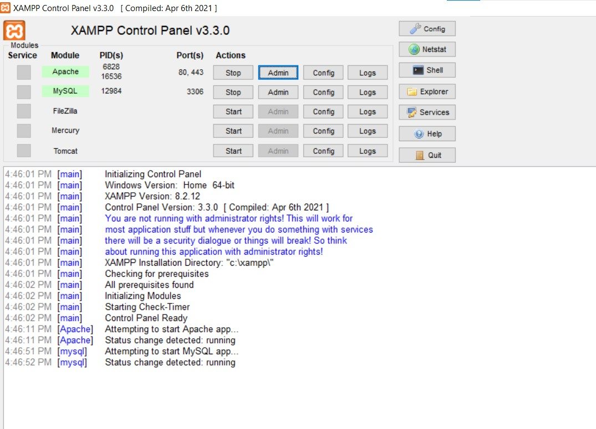
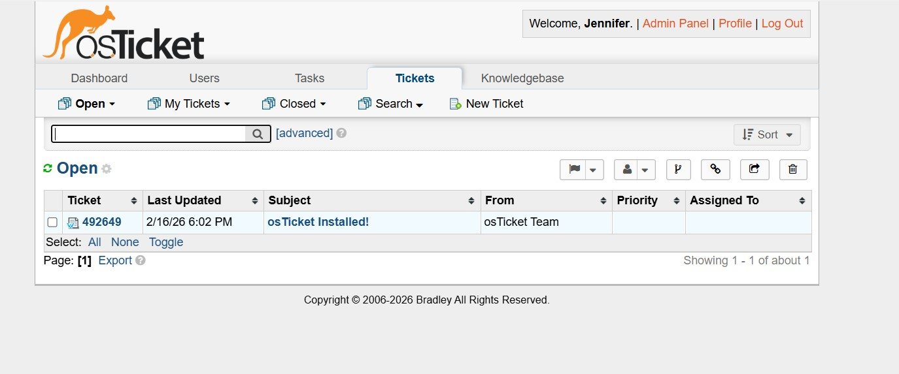
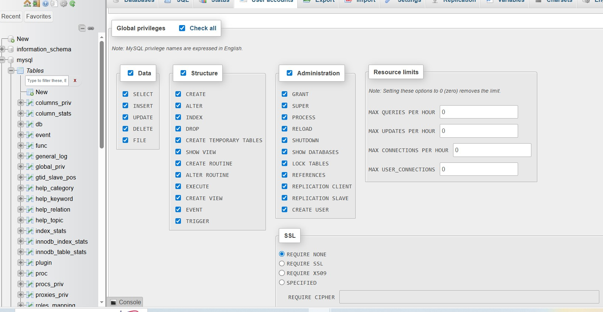
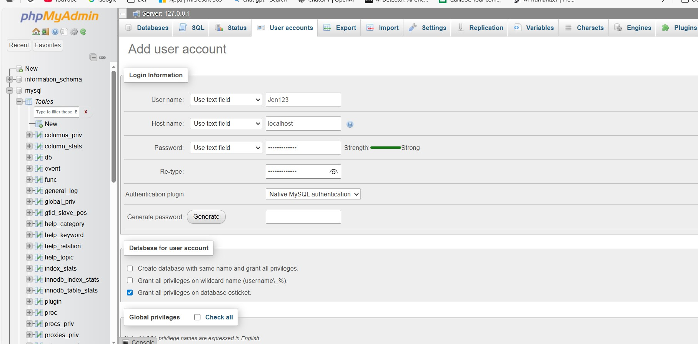
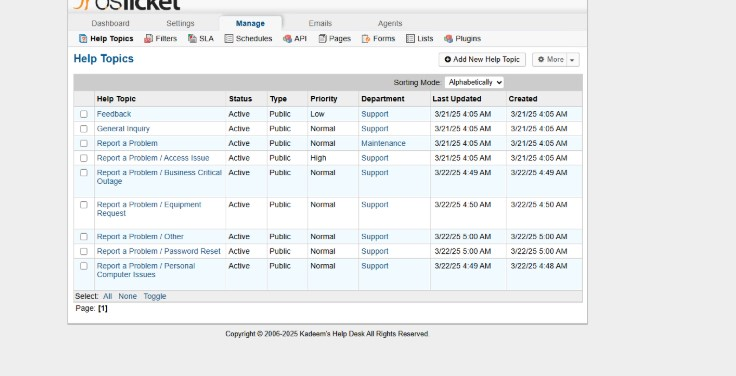
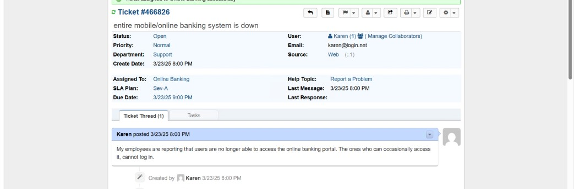

# osTicket-System-Installation
# Windows 11 Help Desk Ticketing System (osTicket)

## Project Overview

This project demonstrates the deployment and configuration of **osTicket**, an open-source Help Desk ticketing system, on a **Windows 11** system using **XAMPP (Apache, MySQL, PHP)**.

The system is designed to simulate a **corporate IT support environment** where end users submit support requests and IT staff manage, prioritize, and resolve tickets through a centralized platform.

This implementation focuses on **service operations, workflow design, access control, and system hardening**, reflecting real-world Help Desk and IT operations practices.

---

## Objectives

- Deploy osTicket on a Windows 11 system
- Configure Apache, MySQL, and PHP using XAMPP
- Secure application configuration files
- Implement structured Help Topics for ticket categorization
- Simulate real-world IT support workflows
- Demonstrate Help Desk operations and administration

---

## Environment & Architecture

- **Operating System:** Windows 11  
- **Web Stack:** XAMPP  
  - Apache  
  - MySQL  
  - PHP  
- **Ticketing Platform:** osTicket  
- **Database:** MySQL (phpMyAdmin)  

  
  
  

---

## Application Deployment & Configuration

osTicket was installed locally on the Windows 11 system using XAMPP as the web and database platform.

Key configuration steps included:
- Enabling required PHP extensions
- Creating a dedicated MySQL database and user
- Completing the osTicket web-based installer
- Validating prerequisite checks

This setup mirrors how internal Help Desk tools are deployed within small to mid-sized organizations.

  
  

---

## Security Hardening & Finalization

After installation, the system was secured using standard best practices:

- Renamed `ost-sampleconfig.php` to `ost-config.php`
- Set `ost-config.php` to read-only
- Removed the `/setup` directory
- Verified restricted access to configuration files
- Confirmed proper client and staff portal access

These steps reduce the risk of unauthorized changes and configuration abuse.

---

## Help Desk Workflow Configuration

Help Topics were configured to support realistic IT service operations.

**Admin Panel → Manage → Help Topics**

### Configured Help Topics
- Business Critical Outage  
- Personal Computer Issues  
- Equipment Request  
- Password Reset  
- Other  

Each Help Topic supports ticket routing, prioritization, and assignment to appropriate support teams.

  
  

---

## Example Support Scenario

**Scenario:**  
- Organization-wide service outage impacting core business systems  
- Ticket Category: Business Critical Outage  
- Priority: High  
- Assigned Team: IT Support  
- Source: Client Portal submission  

This demonstrates how osTicket supports incident tracking, escalation, and resolution documentation.

---

## Key Takeaways

This project demonstrates how a Help Desk ticketing system can be deployed and configured to support **real-world IT operations**. The focus extends beyond installation to include workflow design, access management, and system security.

### Skills Demonstrated
- Help Desk system deployment
- IT service workflow design
- Windows-based application configuration
- Secure configuration management
- Ticket categorization and incident handling

---

